# 📊 Esquema do Banco de Dados - Sistema de Credenciais

**📅 Data da Análise:** 21/11/2025
**🔗 Sistema:** Laravel 12 + Filament 4 + MySQL
**📦 Pacotes:** Spatie Laravel Permission
**✅ Status:** Refatorado e Consolidado

---

## 📋 Resumo Executivo

**Total de Tabelas:** 12
**Tabelas de Negócio:** 3 (users, credentials, roles/permissions)
**Tabelas de Sistema:** 5 (migrations, failed_jobs, password_reset_tokens, personal_access_tokens)
**Tabelas de Relacionamento:** 3 (model_has_roles, model_has_permissions, role_has_permissions)
**Tabelas de Auditoria:** 1 (activity_logs)

---

## 🔄 Refatoração Completa (21/11/2025)

### ✅ Mudanças Implementadas:

1. **Consolidação de Migrations**: Todas as migrations foram consolidadas em um único arquivo `2025_11_21_000001_create_consolidated_database_schema.php`
2. **Campos Opcionais**: `concession` e `validity` agora são opcionais (nullable)
3. **Strings Não Criptografadas**: Campo `credential` é agora VARCHAR simples (não criptografado)
4. **Níveis de Sigilo**: Adicionado 'O' (Ostensivo) além de 'R' (Reservado) e 'S' (Secreto)
5. **Seeders Robustos**: Criados seeders com diferentes perfis de usuários e credenciais
6. **Frontend Alinhado**: Formulários Filament ajustados para refletir o backend

---

## 🗂️ Tabela: credentials

### Estrutura Atual (Pós-Refatoração)

| Campo        | Tipo             | Nullable | Default | Observações                          |
|--------------|------------------|----------|---------|--------------------------------------|
| id           | BIGINT UNSIGNED  | NO       | -       | Primary Key, Auto Increment          |
| user_id      | BIGINT UNSIGNED  | YES      | NULL    | Foreign Key → users.id               |
| fscs         | VARCHAR(255)     | NO       | -       | Unique, código identificador único   |
| name         | VARCHAR(255)     | NO       | -       | Nome descritivo da credencial        |
| secrecy      | VARCHAR(255)     | NO       | -       | Nível: 'O', 'R', 'S'                |
| credential   | VARCHAR(255)     | NO       | -       | **STRING** não criptografada         |
| concession   | DATE             | **YES**  | NULL    | **OPCIONAL** - Data de concessão     |
| validity     | DATE             | **YES**  | NULL    | **OPCIONAL** - Data de validade      |
| created_at   | TIMESTAMP        | YES      | NULL    | Data de criação                      |
| updated_at   | TIMESTAMP        | YES      | NULL    | Data de atualização                  |
| deleted_at   | TIMESTAMP        | YES      | NULL    | Soft Delete                          |

### Níveis de Sigilo:
- **O** (Ostensivo): Informação pública
- **R** (Reservado): Acesso restrito
- **S** (Secreto): Alto nível de confidencialidade

### Relacionamentos:
- **belongsTo**: User (user_id → users.id, onDelete: CASCADE)

---

## 🚀 Índices Otimizados

### Tabela: credentials

Os seguintes índices foram criados para otimizar performance de queries:

- **credentials_fscs_unique** (UNIQUE): `fscs`
  - Garante unicidade do código FSCS
  - Usado em queries de busca por FSCS específico

- **credentials_validity_index**: `validity`
  - Otimiza queries de filtro por validade
  - Melhora performance em queries de credenciais expiradas/expirando
  - Exemplo: `WHERE validity > NOW()` ou `WHERE validity BETWEEN ... AND ...`

- **credentials_created_at_index**: `created_at`
  - Otimiza ordenação cronológica
  - Melhora performance em listagens ordenadas por data de criação
  - Exemplo: `ORDER BY created_at DESC`

- **credentials_user_validity_index** (COMPOSITE): `user_id, validity`
  - Índice composto para queries combinadas
  - Otimiza busca de credenciais por usuário e validade
  - Exemplo: `WHERE user_id = ? AND validity > NOW()`

- **credentials_secrecy_index**: `secrecy`
  - Otimiza filtros por nível de sigilo
  - Melhora performance em queries de credenciais secretas/reservadas
  - Exemplo: `WHERE secrecy = 'S'`

### Tabela: users

- **users_email_unique** (UNIQUE): `email`
  - Garante unicidade do email (índice padrão do Laravel)
  
- **users_email_index**: `email`
  - Índice adicional para otimizar autenticação
  - Melhora performance em queries de login
  
- **users_created_at_index**: `created_at`
  - Otimiza listagens ordenadas por data de cadastro
  - Exemplo: `ORDER BY created_at DESC`

**📝 Nota:** Todos os índices possuem métodos `down()` implementados para permitir rollback completo das migrations.

---

## 🧜‍♀️ Diagrama ER (Mermaid)

```mermaid
erDiagram
    USERS ||--o{ CREDENTIALS : "possui"
    USERS ||--o{ MODEL_HAS_ROLES : "tem"
    ROLES ||--o{ MODEL_HAS_ROLES : "atribuído a"
    ROLES ||--o{ ROLE_HAS_PERMISSIONS : "tem"
    PERMISSIONS ||--o{ ROLE_HAS_PERMISSIONS : "pertence a"
    USERS ||--o{ MODEL_HAS_PERMISSIONS : "tem direta"
    PERMISSIONS ||--o{ MODEL_HAS_PERMISSIONS : "atribuída a"

    USERS {
        bigint id PK
        string name
        string email UK
        timestamp email_verified_at
        string password
        string remember_token
        timestamp created_at
        timestamp updated_at
    }

    CREDENTIALS {
        bigint id PK
        bigint user_id FK
        string fscs
        string name
        string secrecy
        string credential
        date concession
        date validity
        timestamp created_at
        timestamp updated_at
        timestamp deleted_at
    }

    ROLES {
        bigint id PK
        string name
        string guard_name
        timestamp created_at
        timestamp updated_at
    }

    PERMISSIONS {
        bigint id PK
        string name
        string guard_name
        timestamp created_at
        timestamp updated_at
    }

    MODEL_HAS_ROLES {
        bigint role_id FK
        string model_type
        bigint model_id
    }

    ROLE_HAS_PERMISSIONS {
        bigint permission_id FK
        bigint role_id FK
    }
```



---

## 🎯 Tabelas de Negócio (Core Business)

### 1. **USERS** - Usuários do Sistema
```sql
CREATE TABLE users (
    id                BIGINT UNSIGNED PRIMARY KEY AUTO_INCREMENT,
    name              VARCHAR(255) NOT NULL,
    email             VARCHAR(255) NOT NULL UNIQUE,
    email_verified_at TIMESTAMP NULL,
    password          VARCHAR(255) NOT NULL,
    remember_token    VARCHAR(100) NULL,
    created_at        TIMESTAMP NULL,
    updated_at        TIMESTAMP NULL
);
```
**🔗 Relacionamentos:**
- `hasMany(Credential::class)`
- `belongsToMany(Role::class)`

### 2. **CREDENTIALS** - Credenciais de Segurança
```sql
CREATE TABLE credentials (
    id          BIGINT UNSIGNED PRIMARY KEY AUTO_INCREMENT,
    user_id     BIGINT UNSIGNED NULL,
    fscs        VARCHAR(255) NOT NULL,
    name        VARCHAR(255) NOT NULL,
    secrecy     VARCHAR(255) NULL,
    credential  VARCHAR(255) NULL,
    concession  DATE NULL,
    validity    DATE NULL,
    created_at  TIMESTAMP NULL,
    updated_at  TIMESTAMP NULL,
    deleted_at  TIMESTAMP NULL,
    
    FOREIGN KEY (user_id) REFERENCES users(id) ON DELETE SET NULL
);
```
**🔗 Relacionamentos:**
- `belongsTo(User::class)`

---

## 🛡️ Sistema de Permissões (Spatie)

### 3. **ROLES**
```sql
CREATE TABLE roles (
    id         BIGINT UNSIGNED PRIMARY KEY AUTO_INCREMENT,
    name       VARCHAR(255) NOT NULL,
    guard_name VARCHAR(255) NOT NULL,
    created_at TIMESTAMP NULL,
    updated_at TIMESTAMP NULL,
    UNIQUE KEY (name, guard_name)
);
```

### 4. **PERMISSIONS**
```sql
CREATE TABLE permissions (
    id         BIGINT UNSIGNED PRIMARY KEY AUTO_INCREMENT,
    name       VARCHAR(255) NOT NULL,
    guard_name VARCHAR(255) NOT NULL,
    created_at TIMESTAMP NULL,
    updated_at TIMESTAMP NULL,
    UNIQUE KEY (name, guard_name)
);
```

### 5. **MODEL_HAS_ROLES** (Pivot)
```sql
CREATE TABLE model_has_roles (
    role_id    BIGINT UNSIGNED NOT NULL,
    model_type VARCHAR(255) NOT NULL,
    model_id   BIGINT UNSIGNED NOT NULL,
    PRIMARY KEY (role_id, model_id, model_type),
    FOREIGN KEY (role_id) REFERENCES roles(id) ON DELETE CASCADE
);
```

### 6. **ROLE_HAS_PERMISSIONS** (Pivot)
```sql
CREATE TABLE role_has_permissions (
    permission_id BIGINT UNSIGNED NOT NULL,
    role_id       BIGINT UNSIGNED NOT NULL,
    PRIMARY KEY (permission_id, role_id),
    FOREIGN KEY (permission_id) REFERENCES permissions(id) ON DELETE CASCADE,
    FOREIGN KEY (role_id) REFERENCES roles(id) ON DELETE CASCADE
);
```

### 7. **MODEL_HAS_PERMISSIONS** (Pivot)
```sql
CREATE TABLE model_has_permissions (
    permission_id BIGINT UNSIGNED NOT NULL,
    model_type    VARCHAR(255) NOT NULL,
    model_id      BIGINT UNSIGNED NOT NULL,
    PRIMARY KEY (permission_id, model_id, model_type),
    FOREIGN KEY (permission_id) REFERENCES permissions(id) ON DELETE CASCADE
);
```

---

## 🔧 Tabelas de Sistema

### 8. **FAILED_JOBS**
```sql
CREATE TABLE failed_jobs (
    id         BIGINT UNSIGNED PRIMARY KEY AUTO_INCREMENT,
    uuid       VARCHAR(255) NOT NULL UNIQUE,
    connection TEXT NOT NULL,
    queue      TEXT NOT NULL,
    payload    LONGTEXT NOT NULL,
    exception  LONGTEXT NOT NULL,
    failed_at  TIMESTAMP NOT NULL DEFAULT CURRENT_TIMESTAMP
);
```

### 9. **MIGRATIONS**
```sql
CREATE TABLE migrations (
    id        INT UNSIGNED PRIMARY KEY AUTO_INCREMENT,
    migration VARCHAR(255) NOT NULL,
    batch     INT NOT NULL
);
```

### 10. **PASSWORD_RESET_TOKENS**
```sql
CREATE TABLE password_reset_tokens (
    email      VARCHAR(255) PRIMARY KEY,
    token      VARCHAR(255) NOT NULL,
    created_at TIMESTAMP NULL
);
```

### 11. **PERSONAL_ACCESS_TOKENS**
```sql
CREATE TABLE personal_access_tokens (
    id             BIGINT UNSIGNED PRIMARY KEY AUTO_INCREMENT,
    tokenable_type VARCHAR(255) NOT NULL,
    tokenable_id   BIGINT UNSIGNED NOT NULL,
    name           VARCHAR(255) NOT NULL,
    token          VARCHAR(64) NOT NULL UNIQUE,
    abilities      TEXT NULL,
    last_used_at   TIMESTAMP NULL,
    expires_at     TIMESTAMP NULL,
    created_at     TIMESTAMP NULL,
    updated_at     TIMESTAMP NULL
);
```